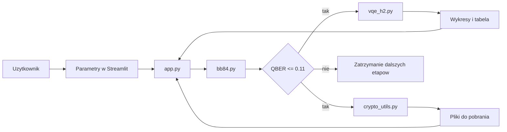

# Dokumentacja techniczna projektu `quantumDUO`

## 1. Cel projektu
`quantumDUO` jest demonstracyjną aplikacją łączącą trzy obszary:
- kwantową dystrybucję klucza `BB84`,
- hybrydową symulację kwantową `VQE` dla cząsteczki wodoru `H2`,
- klasyczne szyfrowanie wyników obliczeń kluczem pochodzącym z fazy BB84.

Celem projektu nie jest budowa pełnego systemu produkcyjnego, ale pokazanie spójnego przepływu:
1. użytkownik uruchamia symulację BB84,
2. aplikacja ocenia bezpieczeństwo kanału na podstawie `QBER`,
3. jeśli kanał jest bezpieczny, wykonywana jest symulacja VQE,
4. wyniki zostają zaszyfrowane i udostępnione do pobrania.

## 2. Architektura systemu



### 2.1 Odpowiedzialność modułów
- `app.py` odpowiada za interfejs użytkownika, parametry wejściowe, buforowanie wyników i orkiestrację całego przepływu.
- `bb84.py` implementuje symulację BB84, obliczanie `QBER`, wykresy, heatmapę i tryb edukacyjnego walkthrough.
- `vqe_h2.py` implementuje model 2-kubitowego Hamiltonianu `H2`, obliczenia `VQE`, wynik dokładny oraz wykresy energii i błędu.
- `crypto_utils.py` odpowiada za generowanie klucza bajtowego z bitów, pochodną klucza `SHA-256`, szyfrowanie `AES-CTR`, tryb awaryjny `XOR` oraz kodowanie `Base64`.

### 2.2 Przepływ sterowania
W `app.py` najważniejsza decyzja ma postać:

```python
channel_secure = qber_clean is not None and qber_clean <= QBER_SECURITY_THRESHOLD
```

To oznacza, że fazy `VQE` i szyfrowania są wykonywane tylko wtedy, gdy kanał po odsianiu bitów ma błąd nie większy niż `0.11`.

## 3. Omówienie bibliotek i importów

### 3.1 Biblioteki standardowe Pythona

#### `csv`
- Używana do eksportu danych tabelarycznych do formatu `CSV`.
- W `app.py` tworzy plik `points.csv` z wynikami `VQE`.
- W `bb84.py` zapisuje szczegółowy przebieg `walkthrough`.

#### `io`
- Dostarcza obiekt `StringIO`, czyli bufor tekstowy w pamięci.
- W `app.py` pozwala przygotować zawartość pliku `CSV` bez zapisu na dysk.

#### `json`
- Służy do serializacji i deserializacji danych.
- W `app.py` buduje ładunek z wynikami `VQE`.
- W `crypto_utils.py` zamienia obiekty Pythona na tekst przed szyfrowaniem i po odszyfrowaniu.

#### `base64`
- Umożliwia bezpieczne zakodowanie binarnego szyfrogramu do tekstu ASCII.
- W `crypto_utils.py` służy do generowania wersji `*.b64`.

#### `os`
- Zapewnia dostęp do funkcji systemowych.
- W `crypto_utils.py` jest używane do generowania losowego `nonce` przez `os.urandom(16)`.

#### `math.ceil`
- Służy do zaokrąglenia w górę długości powielanego klucza.
- W `crypto_utils.py` jest potrzebne do dopasowania długości klucza przy szyfrowaniu `XOR`.

#### `functools.lru_cache`
- Zapewnia prosty cache funkcji.
- W `vqe_h2.py` ogranicza wielokrotne przeliczanie tej samej macierzy Hamiltonianu.

#### `typing.Any`
- Pomaga w adnotacjach typów tam, gdzie struktura danych jest mieszana.
- Występuje w `bb84.py` i `vqe_h2.py`.

#### `__future__.annotations`
- Pozwala używać nowocześniejszych adnotacji typów bez kosztu natychmiastowej ewaluacji.
- Dzięki temu kod ma czytelniejsze sygnatury funkcji.

### 3.2 Biblioteki zewnętrzne

#### `numpy`
- Podstawowa biblioteka numeryczna projektu.
- W `bb84.py` generuje losowe bity i bazy oraz liczy średnią błędów.
- W `vqe_h2.py` przechowuje macierze, liczy wartości własne i iloczyny liniowe.
- W `crypto_utils.py` przyspiesza operację `XOR` na buforach bajtowych.

#### `matplotlib`
- Odpowiada za tworzenie wykresów.
- `matplotlib.use("Agg")` ustawia backend nieinteraktywny, zgodny z generowaniem obrazów przez aplikację webową.
- `matplotlib.pyplot` służy do tworzenia figur dla `QBER`, energii, błędu i heatmapy.

#### `pandas`
- Ułatwia prezentację danych tabelarycznych w interfejsie.
- W `app.py` buduje `DataFrame` dla tabeli walkthrough i tabeli wyników `VQE`.

#### `streamlit`
- Jest warstwą prezentacyjną aplikacji.
- Odpowiada za elementy UI, cache obliczeń, metryki, komunikaty i przyciski pobierania.
- Dzięki niemu projekt działa jako interaktywna aplikacja, a nie skrypt terminalowy.

#### `qiskit`
- Dostarcza podstawowe elementy obwodów kwantowych.
- W `bb84.py` klasa `QuantumCircuit` służy do przygotowania stanów `|0>`, `|1>`, `|+>`, `|->`.
- W `vqe_h2.py` `QuantumCircuit` reprezentuje obwód ansatzu po podstawieniu parametrów.

#### `qiskit-aer`
- Zapewnia szybki lokalny symulator obwodów kwantowych.
- `AerSimulator` w `bb84.py` wykonuje pojedyncze pomiary kubitów w wybranej bazie.

#### `qiskit.quantum_info`
- `SparsePauliOp` reprezentuje Hamiltonian zapisany jako suma operatorów Pauliego.
- `Statevector` pozwala policzyć stan kwantowy ansatzu i wartość oczekiwaną energii.

#### `qiskit.circuit.library`
- `EfficientSU2` dostarcza gotowy parametryzowany ansatz do `VQE`.
- To wygodna i dobrze znana konstrukcja dla małych układów kwantowych.

#### `scipy.optimize`
- `minimize` realizuje klasyczną część algorytmu `VQE`.
- Metoda `L-BFGS-B` iteracyjnie dobiera parametry ansatzu, minimalizując energię.

#### `cryptography`
- Dostarcza produkcyjne implementacje prymitywów kryptograficznych.
- W `crypto_utils.py` używane są:
  - `Cipher`,
  - `algorithms.AES`,
  - `modes.CTR`,
  - `hashes.SHA256`.
- Biblioteka odpowiada za bezpieczne szyfrowanie `AES-CTR` i generowanie skrótu `SHA-256`.

### 3.3 Importy wewnętrzne projektu
- `app.py` importuje funkcje z `bb84.py`, `vqe_h2.py` i `crypto_utils.py`.
- `bb84.py`, `vqe_h2.py` oraz `crypto_utils.py` są od siebie logicznie odseparowane.
- Taki układ jest korzystny, bo moduły obliczeniowe nie są sprzężone bezpośrednio między sobą.

## 4. Jak działa kod

### 4.1 Moduł `bb84.py`

#### `compute_qber(alice, bob)`
Funkcja oblicza udział różnych bitów po odsianiu pozycji z niezgodnymi bazami:

```python
return float(np.mean(a != b))
```

Dlaczego to działa:
- `QBER` jest z definicji odsetkiem błędnych bitów w kluczu odsianym.
- Jeśli kanał jest idealny i nikt nie podsłuchuje, Alice i Bob powinni uzyskiwać zgodne bity.
- Każdy dodatkowy błąd wynika z pomyłki pomiarowej, szumu lub ingerencji Eve.

#### `_prepare_state(bit, basis)`
Funkcja koduje bit Alice do stanu kwantowego:
- w bazie `Z` bit `0` to `|0>`, a bit `1` to `|1>`,
- w bazie `X` bit `0` to `|+>`, a bit `1` to `|->`.

Dlaczego to działa:
- protokół BB84 opiera się właśnie na dwóch sprzężonych bazach pomiarowych,
- pomiar w niezgodnej bazie daje wynik losowy, więc podsłuch jest wykrywalny.

#### `_measure_in_basis(qc, basis, sim)`
Funkcja dodaje odpowiednią bramkę przed pomiarem:
- dla bazy `X` wykonuje `H`, aby zamienić pomiar w bazie `X` na standardowy pomiar w bazie obliczeniowej,
- następnie wykonuje pomiar jednego strzału (`shots=1`).

Dlaczego to działa:
- pomiar kwantowy w symulatorze Qiskit zwraca klasyczny wynik `0` lub `1`,
- obrót baz przez `H` jest standardową techniką zmiany bazy pomiarowej.

#### `_bb84_core(...)`
To centralna funkcja fazy BB84. Realizuje:
1. losowanie bitów i baz Alice oraz baz Boba,
2. ewentualne przechwycenie przez Eve,
3. ewentualny szum kanału,
4. pomiar Boba,
5. odsianie pozycji o zgodnych bazach,
6. wyliczenie `QBER`,
7. opcjonalne zapisanie pełnego przebiegu.

Dlaczego to działa:
- jest to bezpośrednia symulacja klasycznego schematu `intercept-resend`,
- jeśli Eve zmierzy kubit w złej bazie, zaburza stan i zwiększa `QBER`,
- jeśli `p_noise` rośnie, liczba błędów także rośnie.

#### `run_bb84(...)`
Funkcja uruchamia trzy warianty:
- kanał bez ataku,
- kanał z pełnym atakiem,
- sweep po różnych wartościach `p_eve`.

Zwraca też `key_bits`, które później służą do szyfrowania.

#### `run_qber_heatmap(...)` i `make_qber_heatmap(...)`
Te funkcje tworzą mapę zależności `QBER` od dwóch zmiennych:
- prawdopodobieństwa podsłuchu,
- prawdopodobieństwa szumu.

Pozwala to łatwo wyjaśnić na prezentacji, że oba zjawiska podnoszą błąd kanału.

### 4.2 Moduł `vqe_h2.py`

#### `H2_COEFFS`
To tabela współczynników uproszczonego 2-kubitowego Hamiltonianu `H2`.
Współczynniki są przygotowane dla kilku odległości między atomami.

Dlaczego to działa:
- cząsteczkę `H2` można po uproszczeniach opisać operatorem działającym na dwóch kubitach,
- taki model zachowuje ogólny kształt krzywej energii, choć nie jest pełną symulacją chemiczną.

#### `build_qubit_hamiltonian(R)`
Buduje Hamiltonian jako sumę operatorów Pauliego:
- `II`,
- `ZI`,
- `IZ`,
- `ZZ`,
- `XX`,
- `YY`.

Dlaczego to działa:
- wiele układów fermionowych po mapowaniu do przestrzeni kubitowej przyjmuje dokładnie taką postać sum operatorów Pauliego,
- `SparsePauliOp` jest naturalnym nośnikiem takiego Hamiltonianu.

#### `_hamiltonian_matrix(R_key)`
Zamienia operator na gęstą macierz i buforuje wynik przez `lru_cache`.

Dlaczego to działa:
- funkcja celu `VQE` jest wywoływana wielokrotnie,
- bez cache ta sama macierz byłaby budowana wiele razy niepotrzebnie.

#### `expectation(mat, state)`
Liczy wartość oczekiwaną energii:

```python
return float(np.real(np.vdot(v, mat @ v)))
```

Dlaczego to działa:
- wzór `⟨psi|H|psi⟩` jest dokładną definicją energii oczekiwanej stanu kwantowego,
- dla Hermitowskiego Hamiltonianu wynik jest liczbą rzeczywistą.

#### `exact_energy(R)`
Liczy dokładną energię stanu podstawowego przez diagonalizację macierzy.

Dlaczego to działa:
- najmniejsza wartość własna Hamiltonianu odpowiada energii stanu podstawowego,
- jest to poprawny punkt odniesienia dla wyniku `VQE`.

#### `vqe_energy(R, seed, reps, maxiter)`
Tworzy ansatz `EfficientSU2`, inicjalizuje parametry i minimalizuje energię.

Dlaczego to działa:
- zasada wariacyjna mówi, że dla dowolnego stanu próbnego energia nie spada poniżej energii podstawowej,
- optymalizator zmienia parametry obwodu tak, by znaleźć stan jak najbliższy rzeczywistemu stanowi podstawowemu.

#### `run_vqe_curve(R_list, ...)`
Uruchamia obliczenia dla kolejnych odległości wiązania i porównuje:
- `E_vqe`,
- `E_exact`,
- `error = |E_vqe - E_exact|`.

To właśnie ten zestaw danych trafia potem do wykresów i plików wynikowych.

### 4.3 Moduł `crypto_utils.py`

#### `bits_to_key_bytes(bits)`
Pakuje bity `0/1` do bajtów.

Dlaczego to działa:
- operacje kryptograficzne działają na bajtach, a nie na listach bitów,
- wynik BB84 trzeba więc przekształcić do reprezentacji binarnej.

#### `derive_key_sha256(key_material)`
Buduje 32-bajtowy klucz z dowolnego materiału wejściowego.

Dlaczego to działa:
- `AES-256` wymaga klucza długości 32 bajtów,
- `SHA-256` daje zawsze wynik tej długości,
- jednocześnie miesza wejście, dzięki czemu wynik nie ujawnia prostych zależności z kluczem surowym.

#### `aes_ctr_encrypt(...)` i `aes_ctr_decrypt(...)`
Realizują szyfrowanie i odszyfrowanie w trybie `CTR`.

Dlaczego to działa:
- `AES-CTR` zamienia szyfr blokowy w szyfr strumieniowy,
- ten sam klucz i `nonce` pozwalają odtworzyć strumień pseudolosowy i odwrócić szyfrowanie,
- prepended `nonce` umożliwia poprawne odszyfrowanie po stronie odbiorcy.

#### `xor_bytes(...)`, `json_encrypt_xor(...)`, `json_decrypt_xor(...)`
Stanowią prosty tryb awaryjny, gdy `AES` jest niedostępny albo wymuszony przez użytkownika.

Dlaczego to działa:
- `XOR` jest odwracalny: `A XOR K XOR K = A`,
- rozwiązanie to jest poprawne technicznie, ale słabe kryptograficznie i pełni tylko funkcję demonstracyjną.

### 4.4 Moduł `app.py`

#### Interfejs
`Streamlit` udostępnia:
- parametry `BB84`,
- parametry `VQE`,
- ustawienia szyfrowania,
- opcje dodatkowe, jak heatmapa i walkthrough.

#### Cache obliczeń
Trzy funkcje są dekorowane przez `@st.cache_data`:
- `cached_bb84`,
- `cached_vqe`,
- `cached_heatmap`.

Dlaczego to działa:
- dla tych samych parametrów wynik obliczeń jest deterministyczny,
- nie trzeba więc liczyć go od nowa po każdym odświeżeniu interfejsu.

#### Zakładki aplikacji
- `BB84` pokazuje jakość kanału i wykresy.
- `VQE H2` pokazuje krzywą energii oraz błąd.
- `Security` pokazuje sposób szyfrowania i przyciski pobierania plików.

#### Weryfikacja round-trip
Po szyfrowaniu aplikacja natychmiast wykonuje deszyfrowanie i sprawdza zgodność danych.

Dlaczego to działa:
- jeśli deszyfrowanie zwróci dokładnie te same dane wejściowe, wiemy, że serializacja, szyfrowanie i odszyfrowanie są ze sobą spójne.

## 5. Dlaczego całe rozwiązanie działa

### 5.1 Poprawność fazy BB84
- BB84 działa, ponieważ nie da się niezauważalnie zmierzyć nieznanego stanu w losowo dobranej bazie.
- Zgodne bazy Alice i Boba dają wspólne bity, a niezgodne są odrzucane.
- Atak `intercept-resend` zwiększa `QBER`, więc podsłuch jest wykrywalny statystycznie.

### 5.2 Znaczenie progu `0.11`
- W projekcie przyjęto `QBER_SECURITY_THRESHOLD = 0.11`.
- Jest to uproszczone odwołanie do klasycznej granicy bezpieczeństwa BB84 wynikającej z analizy Shora i Preskilla.
- Dzięki temu aplikacja ma jasne kryterium: tylko kanał o odpowiednio małym błędzie traktowany jest jako bezpieczny.

### 5.3 Poprawność fazy VQE
- `VQE` działa dzięki zasadzie wariacyjnej mechaniki kwantowej.
- Dla każdego stanu próbnego da się policzyć energię oczekiwaną.
- Optymalizator szuka parametrów, które tę energię minimalizują.
- Porównanie z `exact_energy` weryfikuje, że wynik jest sensowny i zbliża się do rozwiązania dokładnego.

### 5.4 Poprawność fazy szyfrowania
- Wynik `BB84` daje materiał kluczowy.
- `SHA-256` dopasowuje jego długość do wymagań `AES-256`.
- `AES-CTR` zapewnia poufność danych, jeśli klucz i `nonce` są poprawnie użyte.
- Odszyfrowanie round-trip potwierdza techniczną poprawność implementacji.

## 6. Ograniczenia rozwiązania
- Model `BB84` obejmuje tylko uproszczony atak `intercept-resend` i prosty szum typu bit-flip.
- Projekt nie implementuje pełnego łańcucha `QKD`, np. korekcji błędów i privacy amplification.
- Hamiltonian `H2` jest pretabelaryzowany i uproszczony do małego modelu 2-kubitowego.
- Wyniki energetyczne mają charakter demonstracyjny i służą do pokazania kształtu krzywej oraz mechanizmu `VQE`.
- `AES-CTR` zapewnia poufność, ale nie integralność; w systemie produkcyjnym lepszy byłby `AES-GCM` albo `AES-CTR` z `HMAC`.
- Tryb `XOR` nie powinien być traktowany jako bezpieczne szyfrowanie produkcyjne.

## 7. Rozwiązanie oferowane przez projekt
Projekt rozwiązuje problem pokazania jednego, kompletnego scenariusza:
- bezpieczne uzgodnienie materiału kluczowego przez mechanikę kwantową,
- wykonanie obliczeń kwantowych na prostym modelu chemicznym,
- dostarczenie wyniku w formie zaszyfrowanej i gotowej do pobrania.

Jest to rozwiązanie dobre dydaktycznie, bo łączy teorię z działającą aplikacją:
- użytkownik widzi wpływ Eve i szumu na `QBER`,
- obserwuje krzywą energii `H2`,
- rozumie, skąd bierze się decyzja o dopuszczeniu lub zablokowaniu dalszego przetwarzania,
- dostaje namacalny efekt końcowy w postaci zaszyfrowanego pliku.

## 8. Podsumowanie
`quantumDUO` jest modularnym projektem edukacyjno-demonstracyjnym, który w jednym interfejsie pokazuje:
- bezpieczeństwo oparte na prawach fizyki,
- hybrydowy algorytm kwantowo-klasyczny,
- klasyczną warstwę zabezpieczenia wyniku.

Największą zaletą projektu jest spójność całego łańcucha: od przygotowania stanów kwantowych, przez analizę bezpieczeństwa, po zaszyfrowanie wyniku końcowego.
